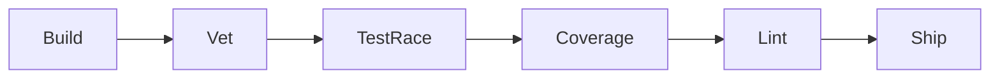

# opencode-kit Development Workflow

## Overview

This document defines the optimal development workflow for **opencode-kit**, a Go CLI tool managing OpenCode configuration. It covers per-task workflows, skills, agents, rules, test methodology, and CI/verification flow.

---

## 1. Per-Task Workflow: Spec → Test → Implement → Verify → Ship

### Phase 1: Understand & Spec

| Step | Action | Skills | Agent |
|------|--------|--------|-------|
| 1.1 | Load project context from engram (`mem_context`) | — | router (auto) |
| 1.2 | Search memory for related work (`mem_search`) | — | router |
| 1.3 | Explore relevant source files | — | explore |
| 1.4 | Write or update spec in the issue/PR | feature-forge | architect |

**Output**: Clear understanding of what needs to change, with key type/func names noted.

### Phase 2: Red (Test First)

| Step | Action | Skills | Agent |
|------|--------|--------|-------|
| 2.1 | Load skills: `golang-testing`, `golang-patterns`, `tdd` | golang-testing, golang-patterns, tdd | coder |
| 2.2 | Write ONE failing test (tracer bullet) | tdd, golang-testing | coder |
| 2.3 | Confirm RED: `go test -run <TestName> ./...` | — | coder |
| 2.4 | Commit RED checkpoint | ecc-git-workflow | coder |

**Output**: One failing test that proves the feedback loop works.

### Phase 3: Green (Implement)

| Step | Action | Skills | Agent |
|------|--------|--------|-------|
| 3.1 | Implement minimal code to pass the test | golang-patterns, golang-pro | coder |
| 3.2 | Run `go vet ./...` — fix all issues | — | coder |
| 3.3 | Confirm GREEN: `go test -run <TestName> ./...` | — | coder |
| 3.4 | Commit GREEN checkpoint | ecc-git-workflow | coder |

**Output**: Passes vet+test, minimal implementation.

### Phase 4: Refactor

| Step | Action | Skills | Agent |
|------|--------|--------|-------|
| 4.1 | Review code for improvements | code-reviewer | reviewer |
| 4.2 | Apply refactors, keep tests GREEN | golang-patterns | coder |
| 4.3 | Run full suite: `go test -race -cover ./...` | — | coder |
| 4.4 | Run `go vet ./...` | — | coder |
| 4.5 | Commit refactor checkpoint | ecc-git-workflow | coder |

**Output**: Clean code, full suite passes, coverage ≥ 60%.

### Phase 5: Verify

| Step | Action | Skills | Agent |
|------|--------|--------|-------|
| 5.1 | Full test suite with race: `go test -race -coverprofile=coverage.out ./...` | — | devops |
| 5.2 | Coverage check: `go tool cover -func=coverage.out` | — | devops |
| 5.3 | Lint: `go vet ./...` | — | devops |
| 5.4 | Build: `go build ./...` | — | devops |
| 5.5 | Integration: run `test-suite.sh` | — | devops |

**Output**: All gates pass.

### Phase 6: Ship

| Step | Action | Skills | Agent |
|------|--------|--------|-------|
| 6.1 | Load `ecc-git-workflow` skill | git-workflow | reviewer |
| 6.2 | PR review by `reviewer` agent | code-reviewer | reviewer |
| 6.3 | Merge, tag, release | — | devops |
| 6.4 | Save session summary to engram | — | router |

**Output**: Shipped code with memory saved.

---

## 2. Skills to Load Per Stage

| Stage | Skills | Why |
|-------|--------|-----|
| Planning | `feature-forge`, `architecture-designer`, `golang-patterns` | Understand domain, design interfaces |
| Writing tests | `golang-testing`, `tdd`, `golang-patterns` | Table-driven tests, RED-GREEN-REFACTOR |
| Implementing | `golang-patterns`, `golang-pro` | Idiomatic Go, error wrapping, concurrency |
| Refactoring | `golang-patterns`, `golang-pro` | Struct design, functional options, interfaces |
| Code review | `code-reviewer`, `golang-patterns` | Review checklist, common issues |
| Debugging | `diagnose`, `debugging-wizard` | Feedback loop, root cause analysis |
| CI/verify | `ecc-deployment-patterns` (subset) | Build, test, coverage gates |

**Do not load all skills at session start.** Load per stage. This keeps context lean.

---

## 3. Agent Routing

| Task | Agent | Rationale |
|------|-------|-----------|
| Complex implementation (>3 files) | `coder` | 256K context for deep work |
| Simple implementation (1-2 files) | `coder` or `fast` | Speed vs depth trade |
| Test writing | `tester` or `coder` | Use tester when test-only work |
| Debugging deep bugs | `debugger` | Reasoning-focused model |
| Code review before merge | `reviewer` | Read-only, safety focus |
| Architecture design | `architect` | System-level thinking |
| CI/CD config | `devops` | Pipeline specialization |
| Documentation | `docs` | Long-context model |
| Quick lookups | `explore` | Fast file/code search |
| Security audit | `security` | Hardening focus |

### Handoff Protocol Between Agents

1. Save context with `mem_save` (topic_key: `handoff/<feature-name>`)
2. Include: what's done, what's remaining, key files changed
3. Load target agent with the handoff content as prompt
4. Target agent calls `mem_context` to hydrate session context

---

## 4. Rules

### Build and Lint

```bash
go build ./...           # Must pass
go vet ./...             # Must pass (zero warnings)
go mod tidy              # Run before commits that change deps
```

### Test Requirements

```bash
go test -race ./...                      # No race conditions
go test -coverprofile=coverage.out ./...  # Coverage tracking
go tool cover -func=coverage.out          # Per-function coverage
```

**Coverage thresholds** (enforced in CI, aspirational for local):

| Tier | Threshold | Applies To |
|------|-----------|------------|
| Critical (DB, sync) | 80% | `internal/db/`, `internal/sync/` |
| Core (routing, heal) | 60% | `internal/routing/`, `internal/heal/` |
| CLI | 40% | `internal/cli/` |
| Generated/thin wrappers | 0% | `cmd/` |

Rationale: Go does not enforce coverage thresholds natively. These are manual gates in CI until a tool (golangci-lint with coverage or custom script) is added.

### Commit Conventions

```
type(scope): brief summary in present tense

[optional body: why, not what]
```

Types: `feat`, `fix`, `test`, `refactor`, `docs`, `chore`, `perf`
Scope: `db`, `cli`, `routing`, `sync`, `heal`, `discover`, `audit`, `models`, `generator`, `profile`

Examples:
```
feat(db): add ProviderID filter for ListModels
fix(routing): handle empty model list in SelectBestModel
test(heal): add integration test for Run()
refactor(db): extract scanModel helper from ListModels
```

### TDD Cycle Commit Format

During active TDD, use checkpoint commits:

```
test(db): add failing test for UpsertProvider
feat(db): implement UpsertProvider
refactor(db): extract common query pattern
```

### Linters

Current setup: `go vet ./...` (Makefile `lint` target).

No golangci-lint installed yet. Recommended additions:

```yaml
# .golangci.yml (future)
linters:
  enable:
    - errcheck
    - staticcheck
    - govet
    - gofmt
    - goimports
    - misspell
    - unconvert
```

---

## 5. Test Methodology

### Primary: TDD (Red-Green-Refactor)

One test → one implementation → repeat. No bulk test writing.

### Test Conventions

- **Table-driven tests** for all functions with multiple inputs/outputs
- **Descriptive test names**: `TestFuncName_Scenario_Expected`
- **Subtests** via `t.Run()` for organizing scenarios
- **Test helpers** with `t.Helper()` for setup/teardown
- **`t.Cleanup()`** for resource cleanup
- **`t.TempDir()`** for temporary files
- **No `time.Sleep()`** in tests — use conditions/channels
- **Interface-based mocking** (no mocking framework) — define interfaces in consumer package

### Test File Organization

```text
internal/db/
  db.go           — production code
  db_test.go      — tests (external package: package db_test)
  models.go       — production code
  routing.go      — production code
  agents.go       — production code
  crud.go         — production code
```

- `_test.go` files use `package db_test` (external tests) to test through the public API
- Internal helpers use `package db` (white-box tests) when needed

### SQLite In-Memory Testing Pattern

```go
func setupTestDB(t *testing.T) *db.DB {
    t.Helper()
    d, err := db.Open(":memory:")
    if err != nil {
        t.Fatalf("open test db: %v", err)
    }
    t.Cleanup(func() { d.Close() })
    return d
}
```

### External Package Testing

Use `package db_test` to ensure tests only exercise the public API:

```go
// db_test.go
package db_test

import (
    "testing"
    "github.com/reeinharddd/okit/internal/db"
)

func TestUpsertProvider(t *testing.T) {
    d := setupTestDB(t) // defined in db_test.go
    p := &models.Provider{...}
    err := d.UpsertProvider(p)
    if err != nil {
        t.Fatalf("UpsertProvider: %v", err)
    }
}
```

---

## 6. CI/Verification Flow



### Pre-Commit (local, run before every commit)

```bash
go build ./...           # Compile check
go vet ./...             # Static analysis
go test -race ./...      # Tests + race detector
```

### Pre-Merge (CI)

```bash
go build ./...
go vet ./...
go test -race -coverprofile=coverage.out ./...
go tool cover -func=coverage.out  # Verify thresholds
gofmt -d .                # Format check (drift detection)
test-suite.sh             # Integration tests
```

### Pre-Release

```bash
make test
make lint
make build-all
test-suite.sh
```

---

## 7. External References

| Topic | URL |
|-------|-----|
| Go testing package | https://pkg.go.dev/testing |
| Table-driven tests | https://go.dev/wiki/TableDrivenTests |
| Cobra CLI testing | https://github.com/spf13/cobra/blob/main/user_guide.md#testing |
| SQLite testing patterns | `:memory:` mode via `modernc.org/sqlite` |

---

## 8. Decision Log

| Decision | Rationale | Alternatives Considered |
|----------|-----------|------------------------|
| Go std testing only (no testify) | One less dependency; table-driven tests cover the same ground | testify (used in legacy tests, already indirect dep) |
| TDD (vertical slices) | Avoids testing imagined behavior; each test responds to real implementation | Horizontal slicing (write all tests first) — rejected for producing brittle tests |
| External test packages (`package db_test`) | Ensures tests exercise public API only; survives refactors | Internal test package — rejected for coupling to implementation |
| 60% baseline coverage | Pragmatic starting point for a young codebase; raise as coverage improves | 80% from tdd-workflow skill — too aggressive for current state |
| Load skills per stage, not session start | Keeps context lean; avoids token waste | Load all at start — rejected for context bloat |
| `go vet` as primary linter | Zero-config, ships with Go, catches real issues | golangci-lint — deferred to future when config overhead is justified |

---

## 9. Stale Tests

All stale test files have been removed. The test suite passes cleanly.
